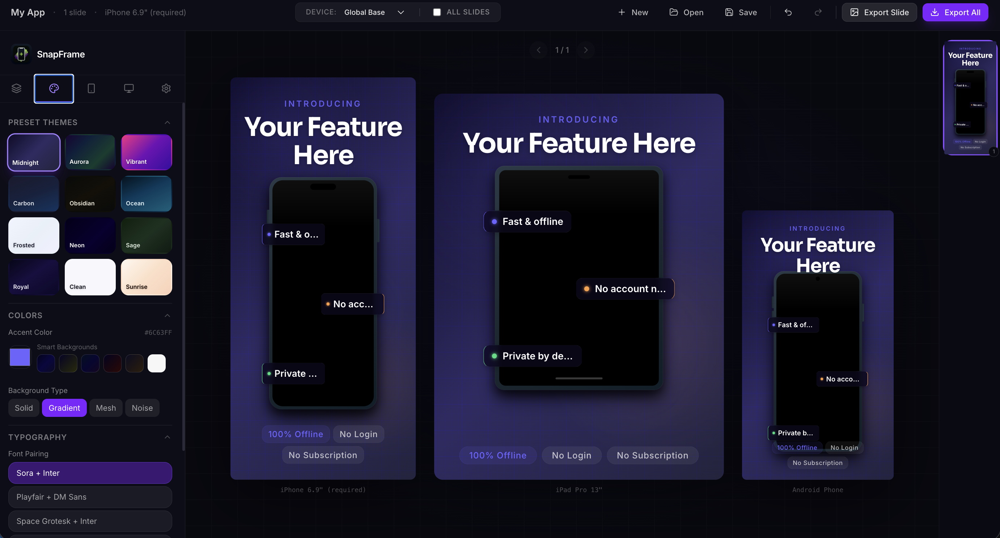

<p align="center">
  
</p>

# Snapframe 🖼️

A professional web-based screenshot builder designed for app developers and designers. Create stunning, marketing-ready screenshots for your apps with ease.

<p align="center">
  
</p>

## ✨ Features

- **Professional Templates**: Choose from curated themes or create your own custom styles.
- **Device Frames**: High-quality device mockups (iPhone, etc.) to showcase your app in context.
- **Per-Slide Theming**: Customize individual slides or apply global themes across your entire project.
- **Dynamic Text Blocks**: Add professional typography with customizable layouts and positioning.
- **Real-time Preview**: See your changes instantly as you edit.
- **High-Quality Export**: Export your screenshots as PNG, JPG, or a compressed ZIP archive for all resolutions.
- **Undo/Redo Support**: Full history management to iterate quickly without fear.
- **Offline First**: Fast and responsive UI with local state management.

## 🚀 Tech Stack

- **Framework**: [React 19](https://react.dev/)
- **Build Tool**: [Vite](https://vitejs.dev/)
- **Styling**: [Tailwind CSS 4](https://tailwindcss.com/)
- **State Management**: [Zustand](https://github.com/pmndrs/zustand)
- **Icons**: [Lucide React](https://lucide.dev/)
- **Export Engine**: `html-to-image` & `jszip`

## 🛠️ Local Setup

Getting started with Snapframe locally is simple:

1. **Clone the repository:**
   ```bash
   git clone https://github.com/Pawandeep-prog/Snapframe.git
   cd Snapframe
   ```

2. **Install dependencies:**
   ```bash
   npm install
   ```

3. **Run the development server:**
   ```bash
   npm run dev
   ```

4. **Open in browser:**
   Navigate to `http://localhost:5173`

## 📦 Building for Production

To create an optimized production build:

```bash
npm run build
```

The output will be in the `dist/` directory.

## 📄 License

This project is licensed under the MIT License - see the [LICENSE](LICENSE) file for details.

---

Built with ❤️ by [Pawandeep Singh](https://github.com/Pawandeep-prog)
